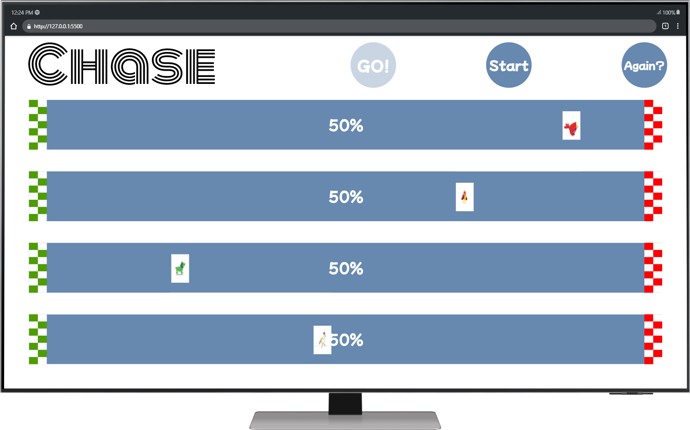

# Chase  - Animal Race Game

interactive race between 4 animals with logic to make the race interasting so chose your winner wisely
## Table of contents

- [Overview](#overview)
  - [The challenge](#the-challenge)
  - [Screenshot](#screenshot)
  - [Links](#links)
- [My process](#my-process)
  - [Built with](#built-with)
  - [What I learned](#what-i-learned)
  - [Continued development](#continued-development)
  - [Useful resources](#useful-resources)
- [Author](#author)

## Overview

### The challenge

Users should be able to:

- View the optimal layout depending on their device's screen size (desktop only)
- The User will be able see all the animals and the track
- The user will be able to start the game and make the game continue step by step

### Screenshot



### Links

<!-- - Live Site URL: [ Click to See the Site](https://firstsignuppageoriguy.netlify.app/) -->

## My process

### Built with

- Semantic HTML5 markup
- SCSS custom properties
- Flexbox
- Vanilla JavaScript
- Desktop only workflow
- Designed in figma

### What I learned

the project was very insightful for me i've learned:

- How to design an app from 0 to 100
- Design the UI and UX of the app
- Work with modern HTML syntax
- how to work with audio files in JS
- How to work with the actual event on the event listner
- How to work with setTimeOut()
- How to Orginze the code

```JavaScript
const bgAudio = new Audio("/assets/music/0139. Picnic - AShamaluevMusic.mp3")
const birdAudio = new Audio("/assets/music/mixkit-toy-whistler-bird-sound-18.wav")
const chickAudio = new Audio("/assets/music/mixkit-chickens-clucking-short-1772.wav")
const dogAudio = new Audio("/assets/music/mixkit-dog-barking-twice-1.wav")
const duckAudio = new Audio("/assets/music/mixkit-chicken-hens-clucking-1768.wav")
 animal.voice.play();
```

### Continued development

I will continue to focus on:

- more organized code and clean code.
- deeper understanding of front end subjects like SCSS and JavaScript.

### Useful resources

- [https://www.w3schools.com/](https://www.w3schools.com/) - this site is my defult site to aquire knowlage about html, css and javascript
- [https://developer.mozilla.org/en-US/](https://developer.mozilla.org/en-US/) - this site if amazing if i and to take a deeper dive to understand properties bout html, css and javascript
- [https://stackoverflow.com/](https://stackoverflow.com/) - amaxing blog site that help a lot for finding answers to common questions

## Author

- Website - [Ori Guy](https://github.com/origuy)
